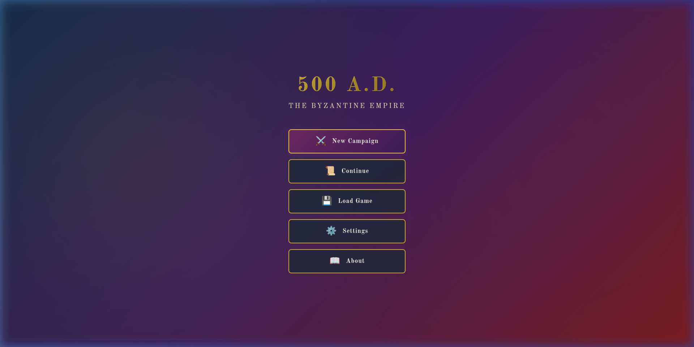
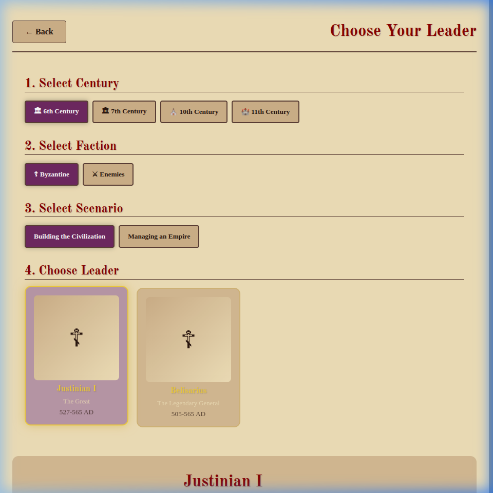
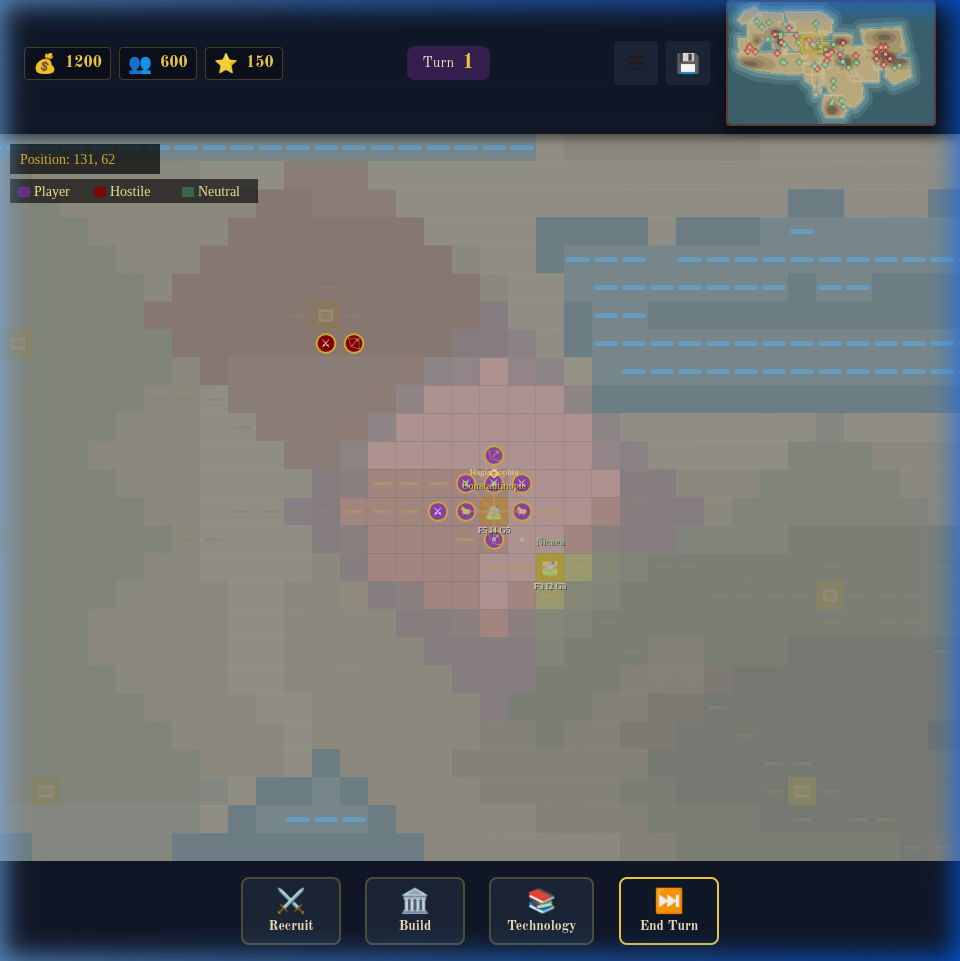

# 500 A.D. - Byzantine Empire Strategy Game

A mobile-optimized turn-based strategy game set in the Byzantine Empire (Eastern Roman Empire) from 500-1453 AD.

⚠️**Work in progress** - keep in mind this is far from being a polished product.


▶️ Check it online at: https://nikolareljin.github.io/500ad/ 

How to [run this locally](#run)?

## 📸 Screenshots & Walkthrough

### Main Menu


### Leader Selection


### Gameplay - Mediterranean Map


### Map Navigation


### 🎥 Video Walkthrough
Watch the complete gameplay walkthrough showing map navigation, unit movement, and the new technology/recruitment systems:


*The walkthrough demonstrates the 320x180 tile historic Byzantine-world map with accurate geography, pan controls, and fog of war revealing as you explore.*

## Overview

Command legendary Byzantine emperors and generals through pivotal moments in Eastern Roman history. Build armies, manage resources, and lead your forces to victory in historically accurate campaigns.

## Features

### Historical Accuracy
- **12 Playable Leaders**: From Justinian I to Constantine XI Palaiologos
- **20+ Military Units**: Historically accurate Byzantine forces including Cataphracts, Varangian Guard, Greek Fire, and **Advanced Naval Merchant Vessels**.
- **Three Historical Eras**: Early (500-717), Middle (717-1025), and Late (1025-1453) Byzantine periods
- **Authentic Leaders**: Each with unique abilities based on historical achievements
- **Historic Road Network**: Control major ancient trade routes including the Via Egnatia and Silk Road branches.

### Massive Geographic Map
- **320x180 Tile Map**: 57,600 tiles covering Europe, North/East Africa, Caucasus, Central Asia, Iran, Afghanistan, and northwestern India
- **Accurate Geography**: Historic-world projection from Atlantic approaches to Persia, and from Britain to the Horn of Africa
- **Major Regions**: 
  - Western: Iberia, France, British Isles, Atlantic coast
  - Central: Italy, Balkans, Central Europe
  - Eastern: Anatolia, Caucasus, Persia, Caspian Sea
  - Southern: North Africa, Sahara, Egypt, Arabia, Red Sea
  - Northern: Ukrainian Steppe
- **Realistic Terrain**: 
  - Water Bodies: Mediterranean (all basins), Black Sea, Caspian Sea, Red Sea, Persian Gulf
  - Mountains: Alps, Pyrenees, Caucasus, Zagros, Atlas, Taurus, Apennines
  - Deserts: Sahara, Arabian, Syrian
- **Heightmap-Based**: 256 elevation levels with natural color gradients
- **Fog of War**: Discover the world as you explore with your units

### Gameplay
- **Turn-Based Strategy**: Tactical combat with resource management
- **Infrastructure System**: Recruit **Engineers** to build a permanent road network, improving travel speed between your cities.
- **Naval Transport**: Embark land units onto **Transports** and **Merchant Ships** to cross the Mediterranean.
- **Technology Tree**: Unlock powerful civic and military upgrades like *Siegecraft*, *Naval Architecture*, and *Military Logistics*.
- **Pan Navigation**: Drag to explore the massive map
- **Top Minimap Navigation**: View the full world and jump to any region with click/drag
- **Unit Progression**: Experience and leveling system
- **Combat System**: Type advantages, terrain modifiers, morale, and fortification modifiers
- **Unit Vitality UI**: Recently damaged units show a map health ring (green -> red) to highlight their current health
- **Fortification System**: Any unit can fortify and build a permanent defensive fort on its tile
- **Healing System**: Recover in towns, while fortified, or from adjacent support/healer units
- **Resource Management**: Gold, manpower, and prestige
- **Save/Load System**: Multiple save slots with auto-save
- **Exploration**: Fog of war reveals as units move and cities are founded

### Mobile Optimized
- **Touch Controls**: Tap to select, drag to move and pan
- **Responsive Design**: Works on phones and tablets
- **Performance Optimized**: Render queueing, fog alpha caching, and viewport-based drawing tuned for the 57,600-tile map
- **Portrait & Landscape**: Supports both orientations

## How to Play

### Starting the Game
1. Run `./run`
2. Select "New Campaign" from the main menu
3. Choose your era (Early, Middle, or Late Byzantine)
4. Select a leader
5. Begin your campaign!

Note: the opening position and controlled towns depend on the selected era, leader, and scenario (including enemy-side campaigns).

### Controls
- **Tap/Click**: Select units or tiles
- **Drag Map**: Pan around the historic world map to explore
- **Minimap Click/Drag**: Reposition the camera quickly to any world area
- **Tap Unit**: View unit details
- **Tap Empty Tile**: Move selected unit
- **End Turn Button**: Complete your turn and generate resources

### Map Navigation
- **Pan**: Click and drag anywhere on the map to move your view
- **Minimap**: Top HUD minimap shows the entire world with current viewport highlighted
- **Fast Travel**: Click or drag on the minimap to jump the visible map section
- **Explore**: Move units to reveal fog of war
- **Position**: Current map coordinates shown in top-left corner
- **Campaign Focus**: Map starts centered on your selected leader's starting realm (or field army for nomadic starts)

### Resources
- **Gold** 💰: Used to recruit units and construct buildings
- **Manpower** 👥: Required to recruit military units
- **Prestige** ⭐: Earned through victories and achievements

### Combat
- Units have different strengths against infantry, cavalry, or buildings
- Terrain provides defensive bonuses
- Morale affects combat effectiveness
- Units gain experience and level up

## Byzantine Leaders

### Early Byzantine (500-717 AD)
- **Justinian I "The Great"**: Reconquest specialist, +20% siege damage
- **Belisarius**: Legendary general, +30% cavalry power
- **Narses**: Infantry master, +25% infantry defense
- **Heraclius**: Reformer, +20% manpower regeneration

### Middle Byzantine (717-1025 AD)
- **Leo III "The Isaurian"**: Fortification expert, +40% defense
- **Basil II "Bulgar-Slayer"**: Relentless conqueror, +25% attack
- **Nikephoros II Phokas**: Heavy cavalry master, +35% cataphract power
- **John I Tzimiskes**: Rapid deployment, +40% movement speed

### Late Byzantine (1025-1453 AD)
- **Alexios I Komnenos**: Diplomatic genius, -30% mercenary costs
- **Manuel I Komnenos**: Naval supremacy, +40% naval power
- **Constantine XI Palaiologos**: Heroic defender, +50% defense when outnumbered
- **Michael VIII Palaiologos**: Reconqueror, +25% when recapturing territories

## Military Units

### Infantry
- **Skutatoi**: Heavy infantry with large shields
- **Psilos**: Light skirmishers
- **Byzantine Archers**: Composite bow specialists
- **Varangian Guard**: Elite Norse axe warriors

### Cavalry
- **Cataphracts**: Super-heavy armored cavalry (signature unit)
- **Klibanophoroi**: Ultra-heavy cavalry
- **Kavallarioi**: Medium cavalry backbone
- **Horse Archers**: Light cavalry with bows
- **Tagmata**: Elite professional cavalry

### Special & Naval Units
- **Engineer Unit**: Specialized non-combat unit for building roads and improving city infrastructure
- **Merchant Galley**: Large transport capable of carrying 3 land units with trade bonuses
- **Greek Fire Dromon**: Elite warship equipped with the deadly Greek Fire siphon for ship-to-ship and siege combat
- **Transport Ship**: Basic naval transport for moving troops across seas
- **Greek Fire Siphon**: Devastating incendiary weapon for land sieges
- **Siege Engineers**: Fortification specialists
- **Orthodox Priests**: Morale and healing support
- **Field Healer**: Dedicated battlefield medical unit with strong adjacent healing

## Technical Details

### Technologies Used
- HTML5 Canvas for map rendering
- Vanilla JavaScript (no frameworks)
- CSS3 with Byzantine-themed design
- LocalStorage for save/load
- Web Audio API for sound

### File Structure
```
500ad/
├── index.html          # Main entry point
├── run                 # Starts local server + opens browser
├── script/             # Compatibility utility wrappers
├── scripts/
│   ├── update.sh       # Updates/pins script-helpers submodule
│   ├── runner.sh       # Runtime launcher for local play
│   └── script-helpers/ # Git submodule (branch: production)
├── css/                # Stylesheets
│   ├── main.css       # Core design system
│   ├── ui.css         # UI components
│   └── mobile.css     # Mobile optimizations
├── js/                 # Game logic
│   ├── game.js        # Main controller
│   ├── state.js       # State management
│   ├── leaders.js     # Leader data
│   ├── units.js       # Unit data
│   ├── combat.js      # Combat system
│   ├── map.js         # Map rendering
│   ├── ui.js          # UI controller
│   ├── audio.js       # Audio manager
│   └── storage.js     # Save/load system
├── assets/            # Graphics and data
│   ├── geography.js   # Polygon-driven historic theater heightmap
│   ├── favicon.svg    # Byzantine four-beta cross icon
│   ├── symbols.js     # Byzantine symbols
│   ├── images/
│   └── audio/
└── docs/              # Documentation
    ├── geography.md   # Geography model and coordinate system
    ├── gameplay-systems.md # Unit health, healing, and fortifications
    └── media/         # Screenshots and videos
```

### Map Coordinates Reference
Key historical cities on the 320x180 map:
- **Constantinople** (Byzantine Capital): positioned from real lat/lon (28.97E, 41.01N)
- **Rome** (Western Capital): positioned from real lat/lon (12.50E, 41.90N)
- **Alexandria** (Egypt): positioned from real lat/lon (29.92E, 31.20N)
- **Baghdad** (Abbasid Capital): positioned from real lat/lon (44.37E, 33.31N)
- **Jerusalem** (Holy City): positioned from real lat/lon (35.22E, 31.78N)
- **Mecca / Medina** (Arabian Peninsula): positioned from real lat/lon
- **Axum / Adulis** (Ethiopia-Horn region): positioned from real lat/lon

### Browser Compatibility
- Chrome/Edge (recommended)
- Firefox
- Safari
- Mobile browsers (Chrome, Firefox, Safari)

<a name="run"></a>
## Running Locally

### One-Liner (Clone + Run)
Copy/paste one of these commands:

- Linux/Mac:

```bash
curl -fsSL https://raw.githubusercontent.com/nikolareljin/500ad/main/scripts/quickstart.sh | bash
```

- Windows:

```powershell
powershell -ExecutionPolicy Bypass -Command "irm https://raw.githubusercontent.com/nikolareljin/500ad/main/scripts/quickstart.ps1 | iex"
```

This will:
1. Clone `500ad` to `~/500ad` (or update it if already cloned)
2. Run `./run` automatically

### Quick Start (Recommended)
```bash
./run
```

This starts a local server, opens the browser automatically, and runs `scripts/update.sh` first if `scripts/script-helpers` is not installed.

### Update Helpers Submodule
```bash
./scripts/update.sh
```

Compatibility alias:
```bash
./script/update.sh
```

### Version Management (Single Source of Truth)
- `VERSION` is the canonical release version used for checks and tagging.
- Set/sync a new version:
```bash
./scripts/version_set.sh 1.1.0
```
- Verify version consistency:
```bash
./scripts/check_release_version.sh
```
- Create annotated release tag from `VERSION`:
```bash
./scripts/tag_release.sh
```

### With Local Server (Recommended)
```bash
cd 500ad
python3 -m http.server 8000
```
Then open `http://localhost:8000` in your browser

### On Mobile Device
1. Start local server on your computer
2. Find your computer's local IP address
3. On mobile, navigate to `http://[YOUR_IP]:8000`

## Development

### Adding New Leaders
Edit `js/leaders.js` and add leader data following the existing format.

### Adding New Units
Edit `js/units.js` and add unit types with stats and bonuses.

### Customizing Appearance
Modify CSS variables in `css/main.css` to change colors and styling.

### Geography and City Coordinates
See `docs/geography.md` for:
- map bounds and projection
- land/sea generation approach
- how city lon/lat values map to 320x180 tile coordinates

## Historical Notes

The Byzantine Empire, also known as the Eastern Roman Empire, lasted from 330 AD (founding of Constantinople) to 1453 AD (Fall of Constantinople). This game focuses on the period from 500-1453 AD, covering:

- **Justinian's Reconquest** (527-565): Attempt to restore the Roman Empire
- **Arab Invasions** (7th-8th centuries): Defense against Islamic expansion
- **Macedonian Renaissance** (9th-11th centuries): Byzantine golden age
- **Crusades** (11th-13th centuries): Complex relations with Western Europe
- **Ottoman Conquest** (14th-15th centuries): Final struggle for survival

All leaders, units, and historical events are based on actual Byzantine history.

## Credits

- **Game Design & Development**: AI-assisted development
- **Historical Research**: Based on Byzantine military history
- **Art Style**: Byzantine mosaic and icon art inspiration
- **Leader Portraits**: AI-generated historical artwork

## Version

**Version 1.2.1** - Enemy/alternate-faction historical starts, century-based enemy control, and nomadic campaign starts

## License

This is a historical educational game. All historical figures and events are in the public domain.

---

**For the Glory of Constantinople! ⚔️👑**
